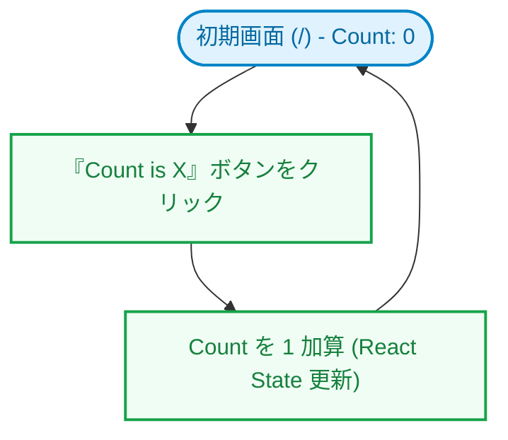

# my-test-app (study-frontend-test)

[](https://github.com/katoy/study-frontend-test/actions/workflows/deploy.yml)

React v19、TypeScript、Vite v8 を使用したモダンなフロントエンド学習・テスト用アプリケーションです。

🚀 **デプロイ先 (GitHub Pages):** [https://katoy.github.io/study-frontend-test/my-test-app/](https://katoy.github.io/study-frontend-test/my-test-app/)

---

## 目次

- [操作デモ（アニメーション）](#操作デモアニメーション)
- [画面遷移・状態遷移](#画面遷移状態遷移)
- [機能詳細](#機能詳細)
- [環境要件・技術スタック](#環境要件技術スタック)
- [デプロイ方針](#デプロイ方針)
- [インストール・セットアップ](#インストールセットアップ)
- [主要コマンド](#主要コマンド)
- [ディレクトリ構造](#ディレクトリ構造)
- [開発ガイド](#開発ガイド)
- [品質保証とコード検証](#品質保証とコード検証)
- [トラブルシューティング](#トラブルシューティング)
- [ライセンス](#ライセンス)

---

## 操作デモ（アニメーション）


**主な操作フロー:**

1. アプリケーションを起動すると、Vite/Reactのブランドロゴとウェルカムセクションが表示されます。
2. 画面中央の「Count is X」ボタンをクリックすると、カウンターの状態（State）が動的にインクリメントされます。
3. 画面下部には、Vite/React의 公式ドキュメントへのリンク、およびコミュニティ（GitHub, Discord, X, Bluesky）へのリンクが設置されています。

> [!TIP]
> 操作デモの自動撮影と高品質GIFへの変換技術は、[browser-tests スキス](file:///Users/katoy/.gemini/config/skills/browser-tests/SKILL.md)にテンプレートが定義されています。

---

## 画面遷移・状態遷移

単一の SPA（Single Page Application）構成であり、ボタン操作によってインタラクティブに状態（State）が遷移します。



---

## 機能詳細

- **React 19 + Vite 8 HMR (Hot Module Replacement)**
  - コード編集時にブラウザをリロードすることなく、即座に変更が反映される開発環境を提供します。
- **インタラクティブなカウンター機能**
  - React の `useState` フックを用いた、基本かつ高速な状態管理デモ。
- **充実した関連リンク集**
  - Vite/React 公式リソースへのクイックアクセスや、Discord/Bluesky などのソーシャルメディアコミュニティへのリンク。
- **厳格な品質管理ツールチェーン**
  - ESLint、Stylelint、Prettier、さらに Rust 製の超高速リンター・フォーマッターである **Biome** を統合し、コードの品質と一貫性を自動的に担保します。
- **カスタムフックのテスト環境 (renderHook)**
  - `@testing-library/react` に統合されている `renderHook` および `act` を用いて、コンポーネントを介さずにカスタムフックを直接テストできます。

---

## 環境要件・技術スタック

### 必要要件

- Node.js v20 以上
- npm または pnpm / yarn

### 技術スタック

| 技術           | バージョン | 用途                                                       |
| -------------- | ---------- | ---------------------------------------------------------- |
| **React**      | ^19.2.7    | UI ライブラリ、状態管理                                    |
| **React DOM**  | ^19.2.7    | DOM レンダリング                                           |
| **TypeScript** | ~6.0.2     | 静的型定義                                                 |
| **Vite**       | ^8.1.1     | ビルドツール・開発サーバー                                 |
| **Vitest**     | ^4.1.10    | テストランナー・テストフレームワーク                       |
| **jsdom**      | ^29.1.1    | テスト用のブラウザ環境（DOM環境）エミュレーター            |
| **Testing Library (React)** | ^16.3.2 | Reactコンポーネントのテスト用ユーティリティ              |
| **jest-dom**   | ^6.9.1     | テスト用カスタムマッチャー（DOMアサーションの拡張）        |
| **user-event** | ^14.6.1    | ブラウザ上のユーザー操作（クリック・入力など）のシミュレート|
| **Playwright** | ^1.62.0    | E2Eテストフレームワーク（マルチブラウザ対応）              |
| **ESLint**     | ^10.6.0    | JavaScript/TypeScript 静的解析                             |
| **Stylelint**  | ^17.14.1   | CSS 静的解析                                               |
| **Prettier**   | ^3.9.6     | コードフォーマッター                                       |
| **Biome**      | (設定あり) | 超高速リンター・フォーマッター（ルールチェック・自動修正） |

---

## デプロイ方針

GitHub Pages への静的ホスティングを想定しています。
Vite のビルドによって生成される `dist/` ディレクトリの静的ファイルを配信します。

---

## インストール・セットアップ

プロジェクトをローカル環境で動かすためのセットアップ手順です。

```bash
# リポジトリをクローン
git clone https://github.com/katoy/study-frontend-test.git
cd study-frontend-test/my-test-app

# 依存関係をインストール
npm install
```

---

## 主要コマンド

`package.json` に定義されている主要な npm スクリプトです。

```bash
# 開発サーバーの起動 (HMR有効)
npm run dev

# プロダクション用ビルド (TypeScriptの型チェック後に Vite ビルドを実行)
npm run build

# アプリケーションの動作確認 (ビルド成果物のプレビュー表示)
npm run preview

# リンターの実行 (ESLint + Stylelint)
npm run lint

# リンターの自動修正
npm run lint:fix

# CSS リンターの実行
npm run lint:style

# CSS リンターの自動修正
npm run lint:style:fix

# Prettier によるコード全体の自動整形
npm run format

# Biome によるコードチェック (Linter + Formatter)
npm run biome:check

# Biome による自動修正
npm run biome:write

# テストの起動 (ウォッチモード)
npm run test

# テストの実行 (シングルラン)
npm run test:run

# PlaywrightによるE2Eテストの実行 (ヘッドレス)
npm run test:e2e

# PlaywrightのインタラクティブUIモードでの実行
npm run test:e2e:ui
```

---

## ディレクトリ構造

本プロジェクトの主要ファイルおよびディレクトリの一覧です。

```text
my-test-app/
├── [public/](file:///Users/katoy/github/study-frontend-test/my-test-app/public)          # 静的アセット配信ディレクトリ
│   ├── [favicon.svg](file:///Users/katoy/github/study-frontend-test/my-test-app/public/favicon.svg) # サイトファビコン
│   └── [icons.svg](file:///Users/katoy/github/study-frontend-test/my-test-app/public/icons.svg)   # UI用SVGスプライトアイコン
├── [src/](file:///Users/katoy/github/study-frontend-test/my-test-app/src)             # ソースコード
│   ├── [assets/](file:///Users/katoy/github/study-frontend-test/my-test-app/src/assets)      # アセット（画像・ロゴなど）
│   │   ├── [hero.png](file:///Users/katoy/github/study-frontend-test/my-test-app/src/assets/hero.png)   # メインのヒーロー画像
│   │   ├── [react.svg](file:///Users/katoy/github/study-frontend-test/my-test-app/src/assets/react.svg) # React ロゴ SVG
│   │   └── [vite.svg](file:///Users/katoy/github/study-frontend-test/my-test-app/src/assets/vite.svg)   # Vite ロゴ SVG
│   ├── [hooks/](file:///Users/katoy/github/study-frontend-test/my-test-app/src/hooks)        # カスタムフック
│   │   ├── [useCounter.ts](file:///Users/katoy/github/study-frontend-test/my-test-app/src/hooks/useCounter.ts) # カウンターロジックのカスタムフック
│   │   └── [useCounter.test.ts](file:///Users/katoy/github/study-frontend-test/my-test-app/src/hooks/useCounter.test.ts) # カスタムフックのユニットテスト
│   ├── [test/](file:///Users/katoy/github/study-frontend-test/my-test-app/src/test)          # テスト用設定
│   │   └── [setup.ts](file:///Users/katoy/github/study-frontend-test/my-test-app/src/test/setup.ts) # テスト共通セットアップ (jest-dom設定など)
│   ├── [App.css](file:///Users/katoy/github/study-frontend-test/my-test-app/src/App.css)       # Appコンポーネント専用CSS
│   ├── [App.test.tsx](file:///Users/katoy/github/study-frontend-test/my-test-app/src/App.test.tsx)  # Appコンポーネントのテストコード
│   ├── [App.tsx](file:///Users/katoy/github/study-frontend-test/my-test-app/src/App.tsx)       # メインコンポーネント (カウンターとリンク)
│   ├── [index.css](file:///Users/katoy/github/study-frontend-test/my-test-app/src/index.css)     # グローバルCSS (共通スタイル、リセット)
│   └── [main.tsx](file:///Users/katoy/github/study-frontend-test/my-test-app/src/main.tsx)      # エントリポイント (Reactレンダリング開始)
├── [tests/](file:///Users/katoy/github/study-frontend-test/my-test-app/tests)            # Playwright E2Eテストコード
│   ├── [app.spec.ts](file:///Users/katoy/github/study-frontend-test/my-test-app/tests/app.spec.ts) # アプリ固有のE2Eテスト
│   └── [example.spec.ts](file:///Users/katoy/github/study-frontend-test/my-test-app/tests/example.spec.ts) # Playwright公式のE2Eテストサンプル
├── [biome.json](file:///Users/katoy/github/study-frontend-test/my-test-app/biome.json)        # Biome のルール・動作設定ファイル
├── [eslint.config.js](file:///Users/katoy/github/study-frontend-test/my-test-app/eslint.config.js)  # ESLint 設定ファイル
├── [index.html](file:///Users/katoy/github/study-frontend-test/my-test-app/index.html)        # メイン HTML テンプレート
├── [package.json](file:///Users/katoy/github/study-frontend-test/my-test-app/package.json)      # プロジェクト依存関係およびスクリプト定義
├── [playwright.config.ts](file:///Users/katoy/github/study-frontend-test/my-test-app/playwright.config.ts) # Playwright設定ファイル
├── [tsconfig.json](file:///Users/katoy/github/study-frontend-test/my-test-app/tsconfig.json)     # TypeScript ルート設定
├── [vite.config.ts](file:///Users/katoy/github/study-frontend-test/my-test-app/vite.config.ts)   # Vite 設定
└── [README.md](file:///Users/katoy/github/study-frontend-test/my-test-app/README.md)        # 本ドキュメント
```

---

## 開発ガイド

### コーディング規約と原則

1. **TypeScript の厳格運用**
   - 型定義を適切に行い、極力 `any` を避けます。
   - tsconfigの厳格モードを維持します。
2. **多重ツールチェーンの併用**
   - リンターには ESLint / Biome を併用し、フォーマッターとして Prettier / Biome を用いてコミット前に整形を行います。
3. **日本語コメントの統一**
   - コード内のインラインコメントや解説は、日本語で記述して統一を図ります。

---

## 品質保証とコード検証

静的解析ツールおよびコードフォーマッターによる品質検証ステータスです。

| ツール名      | 用途                             | 目標                   | 実績ステータス |
| ------------- | -------------------------------- | ---------------------- | -------------- |
| **ESLint**    | JS/TSコード品質・エラー検知      | 警告ゼロ               | **PASS**       |
| **Stylelint** | CSSスタイル整合性チェック        | 警告ゼロ               | **PASS**       |
| **Prettier**  | コード全体の自動整形フォーマット | 一貫したコードスタイル | **PASS**       |
| **Biome**     | 高速ルールチェック・自動整形     | 警告ゼロ               | **PASS**       |
| **Vitest**    | ユニットテスト・結合テスト       | カバレッジ確保・バグ防ぐ | **PASS**       |
| **Playwright**| E2Eテスト (マルチブラウザ対応)   | 複数環境での表示・動作担保| **PASS**       |

---

## トラブルシューティング

#### 問題: `npm run dev` 実行時にポート競合エラーが出る

- **原因**: 他の開発プロセスがすでにデフォルトポート（通常は5173）を使用しています。
- **対策**: Vite は自動的に空いている次のポート（5174など）をアサインしますが、明示的にポートを指定したい場合は以下のコマンドで起動してください。
  ```bash
  npm run dev -- --port 8080
  ```

---

## ライセンス

MIT ライセンスに基づいて公開されています。
